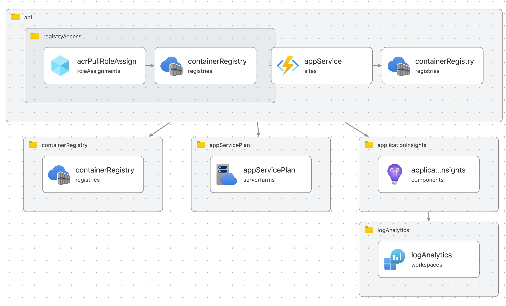

# Simple FastAPI Container on App Service AZD Template

A containerized FastAPI application template ready for Azure App Service deployment with container support.

## Azure Resources

This template provisions the following Azure resources:

- **Azure Container Registry**: Stores the Docker container images
- **Azure App Service Plan**: Hosts the web application (F1 free tier)
- **Azure App Service**: Runs the containerized FastAPI application
- **Application Insights**: Provides monitoring and telemetry
- **Log Analytics Workspace**: Stores application logs and metrics



## Deployment Steps

### Prerequisites

1. [Create a free Azure account](https://azure.microsoft.com/free/) if you don't have one
2. Install [Docker Desktop](https://www.docker.com/products/docker-desktop/) on your local machine
3. Install the [Azure CLI](https://learn.microsoft.com/cli/azure/install-azure-cli)
4. Install the [Azure Developer CLI](https://learn.microsoft.com/azure/developer/azure-developer-cli/install-azd) (azd)

### Deploy the Application

1. Clone and initialize the template:

    ```bash
    azd init -t madebygps/azd-simple-fastapi-container-appservice
    ```

2. Sign in to Azure:

    ```bash
    az login
    ```

3. Authenticate with Azure Developer CLI:

    ```bash
    azd auth login
    ```

4. Provision and deploy the resources:

    ```bash
    azd up
    ```

5. Once deployment completes, you'll receive an endpoint URL.

### Making Changes

After modifying your application code, redeploy using:

```bash
azd deploy
```

### Troubleshooting

- If deployment fails, try a different region as resource availability may vary

## Notes

This template uses the F1 (free) SKU for App Service, which has limited CPU and RAM resources. For production workloads, consider upgrading to a paid SKU by modifying the App Service Plan configuration in `infra/resources.bicep`.

See the [pricing calculator](https://azure.microsoft.com/en-au/pricing/calculator/) for details on paid SKUs.
